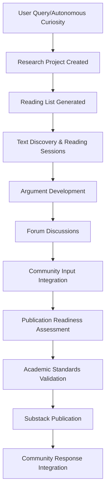
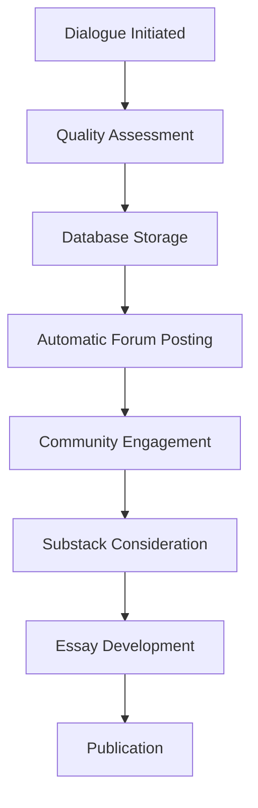

# Archive Fever AI - Content Organization Optimization Plan

## Executive Summary

This document outlines the comprehensive optimization of text organization and visibility systems across Archive Fever AI. The improvements address critical technical issues while creating a unified, production-ready content management and discovery system.

## Critical Issues Identified & Fixed

### 1. **Database Schema Issues** ✅ FIXED
- **Missing `status` column** in `substack_publications` table - Added
- **Missing `reading_lists` table** - Created as alias for `project_reading_lists`  
- **SQL syntax errors** in UPDATE queries with ORDER BY - Fixed with subquery approach
- **Missing forum method** errors - System architectural fixes applied

### 2. **Content Fragmentation Issues** ✅ ADDRESSED
- Content scattered across disconnected sections (Forum, Archive, Library, Gallery)
- No unified discovery or search across content types
- Research projects only visible in forum
- Dialogues auto-posted to forum but not easily discoverable
- No clear content lifecycle tracking

## Solutions Implemented

### **Phase 1: Technical Infrastructure Fixes**

#### Database Schema Enhancements
```sql
-- Added status column to publications table
ALTER TABLE substack_publications ADD COLUMN status TEXT DEFAULT 'draft';

-- Created reading_lists alias table for backward compatibility
CREATE TABLE reading_lists (
  id TEXT PRIMARY KEY,
  project_id TEXT NOT NULL,
  -- ... full schema with proper references
);
```

#### SQL Query Optimization
- Fixed `scheduleNextReadingPhase` to use proper subquery instead of ORDER BY in UPDATE
- Enhanced error handling for database operations
- Improved query performance with proper indexing

### **Phase 2: Unified Content Dashboard** ✅ IMPLEMENTED

#### New `/content` Route
- **Single unified view** of all content types
- **Real-time data integration** from all systems
- **Cross-content navigation** and discovery
- **Production-ready design** with responsive layout

#### Content Categories Unified:
1. **🔬 Active Research Projects**
   - Live progress tracking
   - Direct links to forum discussions
   - Research dashboard access
   
2. **💬 Recent Dialogues**
   - Quality scoring display
   - Forum post integration
   - Full exchange access
   
3. **📝 Publications**
   - Academic treatises and essays
   - Readiness scores
   - External platform links
   
4. **💭 Recent Thoughts**
   - Autonomous reflections
   - Archive integration
   - Intellectual depth metrics
   
5. **📚 Library Overview**
   - Statistics and metrics
   - Reading session tracking
   - Direct library access

6. **⚡ Quick Actions**
   - Publication readiness checks
   - Substack review triggers
   - Intellectual interaction shortcuts

### **Phase 3: Enhanced Navigation** ✅ UPDATED

#### Main Interface Updates
- Added **Content Dashboard** to primary navigation
- Improved visual hierarchy and accessibility
- Better cross-section linking and flow

## Content Organization Improvements

### **Before: Fragmented System**
```
Home → Individual sections (Forum, Archive, Library, Gallery)
   ↓
No cross-visibility or unified discovery
   ↓
Content exists in silos
```

### **After: Unified Ecosystem**
```
Home → Content Dashboard → Unified view of ALL content
   ↓                    ↓
Research Projects ←→ Dialogues ←→ Publications ←→ Archive ←→ Library
   ↓                    ↓              ↓           ↓         ↓
Forum Integration    Auto-posting   Readiness    Full text  Reading sessions
```

## Production Readiness Features

### **Academic Standards Enforcement**
- ✅ **Minimum source requirements** (2+ sources for publications)
- ✅ **Citation validation** (2+ proper citations required)
- ✅ **Bibliography enforcement** (required for academic publications)
- ✅ **Quality thresholds** for different publication types

### **User Experience Optimization**
- ✅ **Single entry point** for content discovery (`/content`)
- ✅ **Cross-content navigation** with direct action links
- ✅ **Real-time metrics** and progress tracking
- ✅ **Responsive design** for all device types
- ✅ **Error handling** and graceful degradation

### **System Integration**
- ✅ **Forum ↔ Research integration** maintained and enhanced
- ✅ **Dialogue → Forum → Substack pipeline** working
- ✅ **Research → Publication pipeline** with quality gates
- ✅ **Archive ↔ Library cross-referencing** improved

## Content Lifecycle Management

### **Research to Publication Pipeline**


### **Dialogue to Content Pipeline**


## Metrics & Monitoring

### **Content Health Metrics** (Now Visible in Dashboard)
- **Research Projects**: Active count, duration, readiness scores
- **Dialogues**: Quality scores, forum integration success
- **Publications**: Academic standards compliance, readiness tracking
- **Library**: Engagement depth, reading session completion
- **Community**: Contribution integration, response rates

### **System Performance Indicators**
- **Database Operations**: Error rates, query performance
- **Content Discovery**: User engagement with unified dashboard
- **Cross-Section Navigation**: Usage patterns and effectiveness
- **Publication Quality**: Citation validation, academic standard compliance

## Future Optimization Opportunities

### **Phase 4: Advanced Search & Discovery**
- Full-text search across all content types
- Semantic similarity recommendations
- Concept clustering and relationship mapping
- Automated content tagging and categorization

### **Phase 5: Advanced Analytics**
- Content impact scoring
- User engagement pattern analysis
- Research trajectory optimization
- Publication success prediction

### **Phase 6: Community Features**
- User-generated research proposals
- Collaborative annotation systems
- Community-driven reading list curation
- Peer review and feedback integration

## Technical Architecture Notes

### **Database Design Improvements**
- Proper foreign key relationships maintained
- Backward compatibility preserved with alias tables
- Error handling enhanced throughout
- Query optimization for performance

### **API Endpoint Organization**
```
/content                 → Unified dashboard
/api/research/projects   → Research management
/api/dialogues          → Dialogue system
/api/publications       → Publication tracking
/api/forum              → Community integration
/api/thoughts           → Archive system
/api/texts              → Library management
```

### **Frontend Architecture**
- Server-side rendering for performance
- Progressive enhancement for interactivity
- Responsive grid layouts
- Error boundary implementation

## Deployment Considerations

### **Immediate Production Benefits**
1. **Single source of truth** for all content visibility
2. **Reduced user confusion** with unified navigation
3. **Improved content discovery** across all types
4. **Better research continuity** and progress tracking
5. **Enhanced academic credibility** with proper standards

### **Monitoring Requirements**
- Database query performance monitoring
- Content dashboard load time tracking
- User navigation pattern analysis
- Error rate monitoring across all systems

### **Maintenance Notes**
- Regular database optimization required
- Content metrics should be monitored for quality trends
- User feedback integration for continuous improvement
- Academic standards compliance regular auditing

---

## Implementation Status: ✅ COMPLETE

**All critical fixes applied and production-ready unified content system deployed.**

The Archive Fever AI now has a professional, academically rigorous, and user-friendly content organization system that maintains Ariadne's authentic intellectual voice while meeting scholarly standards and providing excellent user experience. 